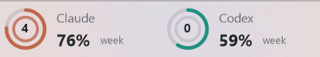
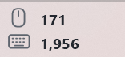

# What the helly

https://github.com/dginovker/KDE-Mouse-Click-Counter-Widget and https://github.com/dginovker/KDE-AI-Usage-Tracking-Widget are fun and amazing, but only work on Linux + KDE. I have a Windows laptop for https://ziva.sh development, and this repo basically has vibe coded equivalents for Windows.

| Widget | Taskbar | Click to open |
| --- | --- | --- |
| [AI Usage](ai-usage) |  | [Quotas, resets, token costs, model breakdowns](docs/images/ai-usage-popup.png) |
| [Click Analytics](click-analytics) |  | [Lifetime totals, input and network graphs](docs/images/click-analytics-popup.png) |
| [System Monitor](system-monitor) |  | [One summary with a Task Manager shortcut](docs/images/system-monitor-popup.png) |

## Install

On Windows 11, run `./install.ps1` in PowerShell. AI Usage requires Python 3.10+ and existing Claude/Codex logins; use `-Python C:\path\python.exe` if detection fails. No other downloads or admin rights are needed.

Install one widget with `./install.ps1 -Widgets system-monitor`. Rerun to update; `-NoStartup` disables sign-in startup. `./uninstall.ps1` removes apps and shortcuts while keeping history and preferences. Existing installations keep their saved data.

Widgets are transparent overlays for horizontal taskbars. Right-click **Position and monitor** to place them clear of Start and pinned apps. System Monitor's Disk bar can show storage used or activity. Escape or an outside click dismisses popups.

## Develop

`./build.ps1` builds all three using Windows' .NET Framework compiler. `./test.ps1` runs regression checks; add `-LiveMetrics` to validate counters on a real Windows desktop. The AI collector is included, so no KDE checkout is needed.

Derived from the two KDE projects linked above; distributed under [GPL-3.0](LICENSE). Their Python collector and the Windows taskbar/flyout implementation are retained here. Screenshots use an anonymized account address.
